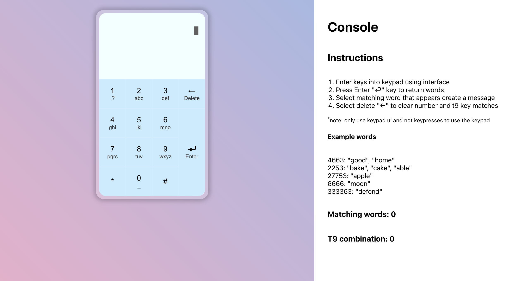
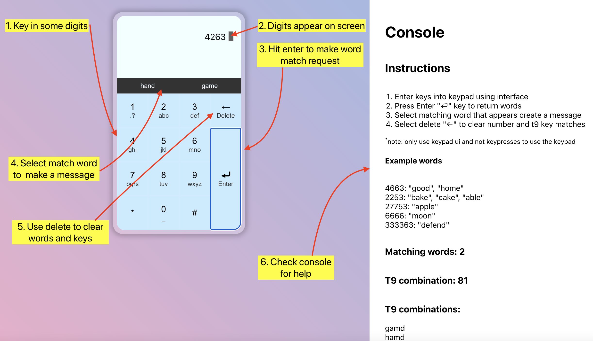

<div id="top"></div>

<!-- PROJECT LOGO -->
<div align="center">

<h1 align="center">Edume test</h3>

  <p align="center">
    T9 keypad technical test
    <br />
  </p>
      <!-- <a href="https://github.com/github_username/repo_name">View Demo</a> -->
</div>

<!-- ABOUT THE PROJECT -->
## About The Project

For this project I followed the brief to create a T9 keypad.

The project contains both a server folder for all api requests to keys and matched words. The client folder for the react front end.

The application can match 3000 common english language words based on the users submission.

Please note that the client runs on `port: 3000` and the server on `port: 5000` so please ensure they are available for testing.


### Built With

I used the following libraries

* React
* Expressjs
* Axios

<p align="right">(<a href="#top">back to top</a>)</p>

<!-- GETTING STARTED -->
## Getting Started

The following commands are intended for a mac user. The project assumes that you have the latest version of `npm` and `git` installed globally in order to clone and run the project successfully.

### Installation

1. Clone the repo
   ```sh
   git clone https://github.com/samburch/edume.git
   ```
2. Navigate to project folder
   ```sh
   cd edume
   ```
3. Navigate to server folder and install package dependancies
   ```sh
   cd server
   ```
   ```sh
   npm install
   ```
4. Start the server on port 5000 with
   ```sh
   npm run dev
   ```
   success will look like this
   ```js
   > server@1.0.0 dev
   > nodemon index
   [nodemon] 2.0.19
   [nodemon] to restart at any time, enter `rs`
   [nodemon] watching path(s): *.*
   [nodemon] watching extensions: js,mjs,json
   [nodemon] starting `node index index.js`
   Server started on port 5000
   ```
5. Open a new terminal winow and navigate to client
6. Navigate to project folder and install package dependancies
   ```sh
   cd edume
   ```
   ```sh
   cd client
   ```
   ```sh
   npm install
   ```
7. Run the command to start the React app locally on port 3000
   ```sh
   npm run start
   ```
8. The app should open in a browser window and you can start to play about with keys

<div align="center">
    
</div>

<p align="right">(<a href="#top">back to top</a>)</p>


<!-- USAGE EXAMPLES -->
## Usage

Once the app is running you can use the keypad to start entering numbers and the return to filter words from the backend.

The console side bar has some instructions on use and will log all results for debugging.

You can build a text message by selecting words from the phone UI.

You can remove any keys and matched words by pressing the delete key. To clear the text message you will need to refresh page.

#### Example key inputs and return words
- `4663` "good", "home"
- `2253` "bake", "cake", "able"
- `27753` "apple"
- `6666` "moon"
- `333363` "defend"

<div align="center">
    
</div>


<p align="right">(<a href="#top">back to top</a>)</p>


<!-- OMMISIONS -->
## Ommissions

- I am not familiar with `Redux` and so I have not included it within this project
- Typically I would use `Tailwind` for personal projects becuase I like the speed and ease of use to build prototypes. For this project I opted to write all my css from scratch to demonstrate my ability

<!-- ISSUES -->
## Known issues

1. Using more than 2000 combinations wont return any matched words to the phone UI but will return the keys, i.e. `2637422` should return `america`. This is due to the get request being too long due to the number of combination parameters and being rejected.

<!-- ACKNOWLEDGMENTS -->
## Acknowledgments

* Thanks to "ef-australia.com.au" for the list of 3000 english common words
  <a href="https://www.ef-australia.com.au/english-resources/english-vocabulary/top-3000-words/">View here</a> 


<p align="right">(<a href="#top">back to top</a>)</p>